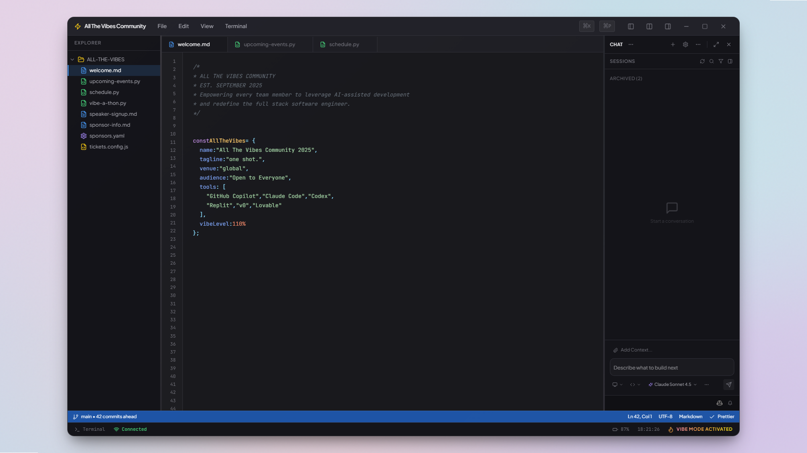
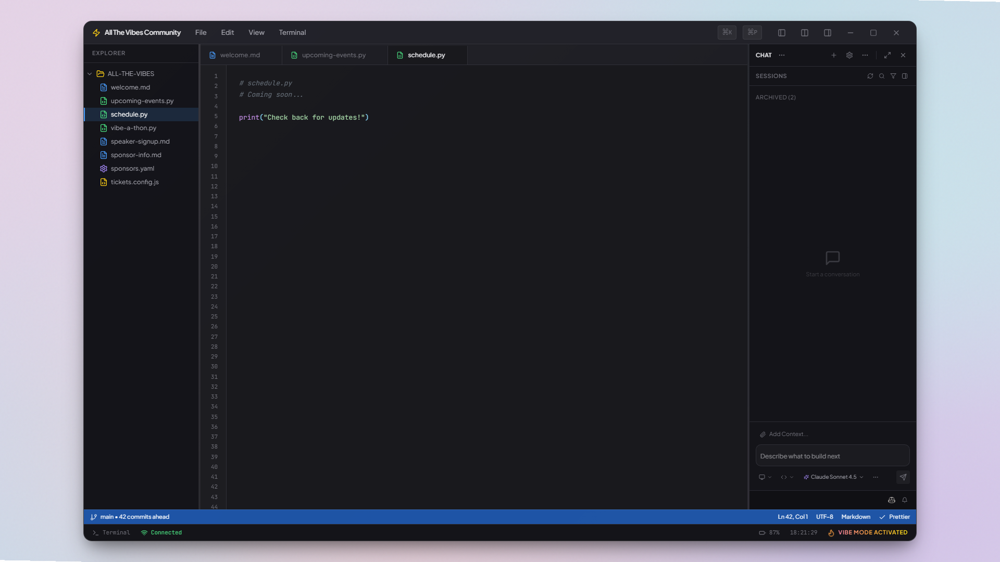

# 🎨 All The Vibes Community

> A VS Code-themed community site for AI-assisted development—built entirely with AI-assisted development.

[](https://vercel.com/sschofield-microsoftcos-projects/v0-all-the-vibes-site)
[](https://v0.app/chat/vV4dxqgDVWY)
[](https://nextjs.org)
[](https://react.dev)
[](https://typescriptlang.org)



## ✨ What is this?

**All The Vibes Community** is an immersive, VS Code-themed community hub for developers exploring AI-assisted coding tools. The entire UI recreates the IDE experience—complete with sidebar navigation, tabbed editors, terminal strips, and status bars—while serving as an event platform and community forum.

The site covers the emerging ecosystem of AI pair-programming tools:
- **GitHub Copilot** — Your AI pair programmer
- **Claude Code** — Anthropic's coding assistant  
- **OpenAI Codex** — GPT-powered code generation
- **Replit** — AI-native development environment
- **v0** — Vercel's generative UI platform
- **Lovable** — AI-first app builder

## 🖼️ Screenshots

| IDE Overview | Topics Page |
|:---:|:---:|
|  |  |

| Tab Navigation | Sidebar |
|:---:|:---:|
|  |  |

### 🎬 Demo


## 🏗️ Architecture

```
┌─────────────────────────────────────────────────────────────────┐
│                         Next.js App                             │
│  ┌─────────────────────────────────────────────────────────────┐│
│  │                    VS Code IDE Shell                         ││
│  │  ┌──────────┬────────────────────────────┬────────────────┐ ││
│  │  │          │         TabBar             │                │ ││
│  │  │          ├────────────────────────────┤                │ ││
│  │  │ Sidebar  │                            │   ChatPanel    │ ││
│  │  │          │        EditorPane          │                │ ││
│  │  │          │   (MarkdownSection,        │   (AI Chat,    │ ││
│  │  │          │    EventCard,              │   Topic Form)  │ ││
│  │  │          │    CountdownWidget)        │                │ ││
│  │  │          │                            │                │ ││
│  │  ├──────────┴────────────────────────────┴────────────────┤ ││
│  │  │                   TerminalStrip                         │ ││
│  │  ├─────────────────────────────────────────────────────────┤ ││
│  │  │                     StatusBar                           │ ││
│  │  └─────────────────────────────────────────────────────────┘ ││
│  └─────────────────────────────────────────────────────────────┘│
├─────────────────────────────────────────────────────────────────┤
│                       Server Actions                            │
│          submitTopic() │ getTopics() │ getTopicWords()          │
├──────────────────────────────┬──────────────────────────────────┤
│          Supabase            │       Topic Modeling Service     │
│   (topic_requests table)     │    (DSPy + Ollama + FastAPI)     │
└──────────────────────────────┴──────────────────────────────────┘
```

### Tech Stack

| Layer | Technology |
|-------|------------|
| **Framework** | Next.js 16.0.10 with App Router |
| **UI** | React 19.2.0 + Tailwind CSS 4.1.9 |
| **Components** | shadcn/ui (new-york style) |
| **Database** | Supabase (PostgreSQL) |
| **AI/ML** | DSPy + Ollama (llama3.2) |
| **Deployment** | Vercel + Docker |

## 🎯 Features

### 🖥️ Immersive IDE Experience
The entire site is wrapped in a pixel-perfect VS Code recreation:
- **TitleBar** — Window controls and branding
- **Sidebar** — Explorer-style navigation with collapsible sections
- **TabBar** — File-tab style navigation between content areas
- **EditorPane** — Main content rendering area
- **ChatPanel** — AI chat interface (cosmetic) + topic submission
- **TerminalStrip** — Collapsible terminal-style panel
- **StatusBar** — Git info, language indicators, line counts

### 📅 Event Management
- **Countdown timers** to upcoming community events
- **One-click calendar downloads** — .ics, Google Calendar, Outlook
- **Event cards** with speaker info, times, and descriptions

### 💬 Community Topics
- **Anonymous topic submissions** — No login required
- **Word cloud visualization** — See what the community is talking about
- **AI-powered topic analysis** — Themes, summaries, agenda generation

### 🤖 AI Topic Modeling Service
A dedicated Python microservice powered by:
- **DSPy** — Programmatic LLM orchestration
- **Ollama** — Local LLM inference (llama3.2)
- **FastAPI** — High-performance API endpoints

Endpoints:
- `POST /analyze` — Extract keywords and categories
- `POST /themes` — Identify cross-topic themes
- `POST /summarize` — Generate executive summaries
- `POST /agenda` — Create event agendas from topics

## 🚀 Quick Start

### Prerequisites
- Node.js 18+
- pnpm (recommended) or npm
- Docker (for topic modeling service)
- Supabase account (or local instance)

### Installation

```bash
# Clone the repository
git clone https://github.com/your-username/all-the-vibes-community.git
cd all-the-vibes-community

# Install dependencies
pnpm install

# Set up environment variables
cp .env.example .env.local
# Edit .env.local with your Supabase credentials
```

### Environment Variables

```env
SUPABASE_URL=your_supabase_url
SUPABASE_ANON_KEY=your_supabase_anon_key
```

### Database Setup

Create the `topic_requests` table in Supabase:

```sql
CREATE TABLE topic_requests (
  id UUID DEFAULT gen_random_uuid() PRIMARY KEY,
  topic TEXT NOT NULL,
  votes INTEGER DEFAULT 0,
  created_at TIMESTAMP WITH TIME ZONE DEFAULT NOW()
);

-- Enable Row Level Security
ALTER TABLE topic_requests ENABLE ROW LEVEL SECURITY;

-- Allow anonymous reads
CREATE POLICY "Anyone can read topics" ON topic_requests
  FOR SELECT USING (true);

-- Allow anonymous inserts
CREATE POLICY "Anyone can insert topics" ON topic_requests
  FOR INSERT WITH CHECK (true);
```

### Running Locally

```bash
# Start the Next.js dev server
pnpm dev

# In a separate terminal, start the topic modeling service
docker compose up -d
```

The app will be available at [http://localhost:3000](http://localhost:3000).

## 📁 Project Structure

```
├── app/                    # Next.js App Router
│   ├── page.tsx           # Main page (OS background + IDE)
│   ├── layout.tsx         # Root layout with providers
│   ├── globals.css        # Global styles
│   └── topics/            # Topics page route
├── components/
│   ├── ide/               # IDE shell components (11 files)
│   │   ├── IDEContainer   # Main IDE wrapper
│   │   ├── IDEWindow      # Window chrome
│   │   ├── Sidebar        # File explorer
│   │   ├── TabBar         # Editor tabs
│   │   ├── EditorPane     # Content area
│   │   ├── ChatPanel      # AI chat sidebar
│   │   ├── StatusBar      # Bottom status bar
│   │   └── ...more
│   ├── editor/            # Content components
│   │   ├── MarkdownSection
│   │   ├── EventCard
│   │   └── CountdownWidget
│   ├── os/                # Desktop metaphor
│   │   ├── OSBackground
│   │   ├── DesktopIcon
│   │   └── FloatingApps
│   └── Topic*.tsx         # Topic-related components
├── lib/
│   ├── actions/topics.ts  # Server Actions
│   ├── db.ts              # Supabase client
│   └── ics-generator.ts   # Calendar file generation
├── services/
│   └── topic-modeling/    # Python AI service
│       ├── main.py        # FastAPI app
│       ├── topic_modeler.py # DSPy + Ollama logic
│       └── Dockerfile
└── scripts/
    ├── capture-ui.mjs     # Playwright screenshot script
    └── analyze_topics.py  # Topic analysis CLI
```

## 🧪 Development

### Key Scripts

```bash
pnpm dev          # Start development server
pnpm build        # Production build
pnpm lint         # Run ESLint
pnpm type-check   # TypeScript type checking
```

### Topic Modeling Service

```bash
# Build and run with Docker
docker compose up topic-modeling

# Or run directly (requires Python 3.11+)
cd services/topic-modeling
pip install -r requirements.txt
ollama pull llama3.2
uvicorn main:app --reload
```

### UI Capture Script

Capture screenshots and video of the running UI:

```bash
# Install Playwright
pnpm add -D playwright
npx playwright install chromium

# Run capture (requires dev server running)
node scripts/capture-ui.mjs

# Convert to GIF (requires ffmpeg)
ffmpeg -i public/screenshots/demo.webm -vf "fps=10,scale=960:-1" demo.gif
```

## 🎨 Design System

Built on shadcn/ui with the **new-york** style variant:

| Token | Value |
|-------|-------|
| `--primary` | VS Code blue accent |
| `--background` | `#1e1e1e` (editor dark) |
| `--foreground` | `#d4d4d4` (editor text) |
| `--muted` | `#252526` (sidebar) |
| `--border` | `#3c3c3c` (subtle) |

Font stack: `var(--font-geist-mono)` for code, `var(--font-geist-sans)` for UI.

## 🤝 Contributing

We welcome contributions! This project follows the Beth-style workflow:

1. Check `Backlog.md` for available work
2. Move task to "In Progress" before starting
3. Complete work with full test coverage
4. Move task to "Completed"
5. Open PR with clear description

See [.github/copilot-instructions.md](.github/copilot-instructions.md) for the full IDEO-style agent system.

## 📝 License

MIT — Use it, fork it, vibe with it.

## 🔗 Links

- **Live Site**: [Vercel Deployment](https://vercel.com/sschofield-microsoftcos-projects/v0-all-the-vibes-site)
- **Build with v0**: [v0.app Chat](https://v0.app/chat/vV4dxqgDVWY)
- **Supabase Dashboard**: [supabase.com](https://supabase.com)

---

<p align="center">
  <sub>Built with ❤️ and a whole lot of AI assistance</sub>
</p>